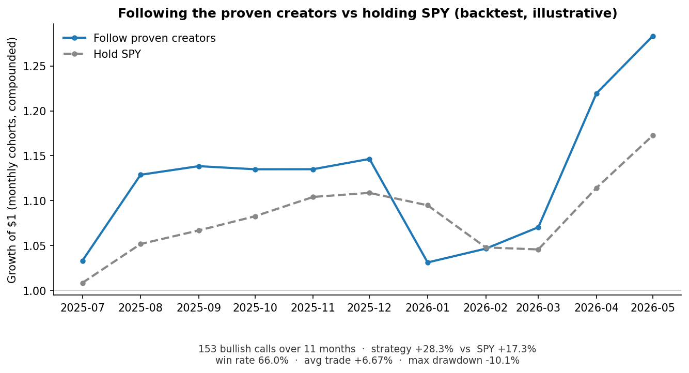
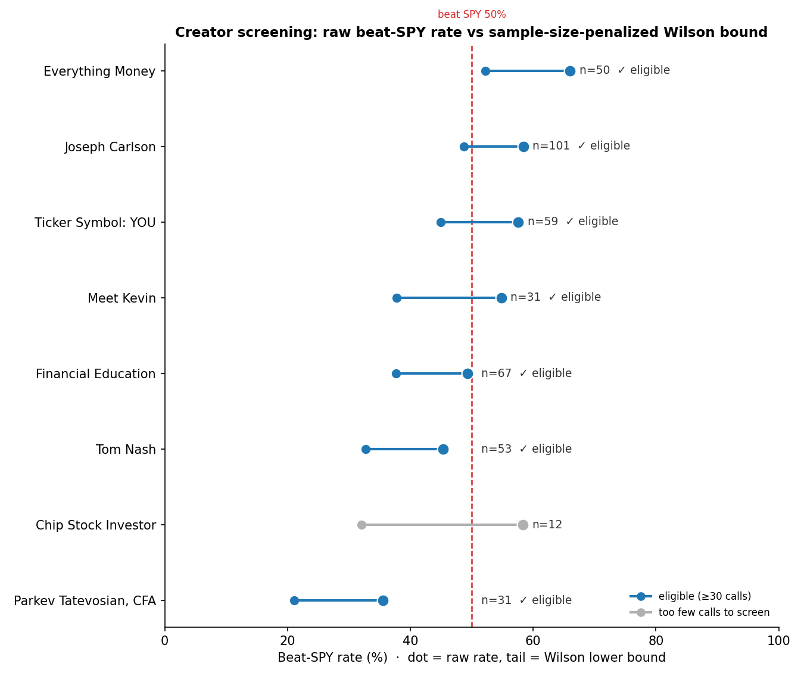

# FinSignal

[](https://github.com/doublejlee/finsignal/actions/workflows/ci.yml)

AI-powered financial sentiment intelligence platform. FinSignal aggregates
finance-YouTube creator opinions, performs **sentence-level** sentiment
attribution using FinBERT, explains *why* each stock is bullish or bearish via
LLM-extracted reasons, and **backtests each creator's track record** against real
price movement — then screens for the few creators whose calls actually beat the market.



<sub>Backtested return of acting on the *screened* creators' bullish calls vs holding SPY — illustrative, see [Results](#results-does-the-signal-actually-hold-up) for methodology and caveats.</sub>

## Live demo
- **API:** https://finsignal-api.onrender.com ([interactive docs](https://finsignal-api.onrender.com/docs)) — Render free tier, first request may cold-start (~30s)
- **Dashboard:** https://finsignal-xrfybejcewfdbtnjumcckb.streamlit.app/ — Streamlit Community Cloud

---

## Architecture

A four-layer pipeline:

```
ingestion/  →  nlp/  →  db/  →  dashboard/
 (YouTube)    (FinBERT,   (DuckDB)   (Streamlit)
              Groq)
```

- **Ingestion** — `youtube-transcript-api` pulls transcripts; YouTube Data API v3
  lists recent videos per channel.
- **Ticker extraction** — regex `$TICKER` + company-name dictionary with
  word-boundary matching and an ambiguity filter.
- **Sentiment** — FinBERT (`ProsusAI/finbert`) run at sentence level with recency
  weighting.
- **Chunking** — spaCy sentence splitting with a ±1 sentence context window per
  ticker mention.
- **Reasons** — ticker-relevant sentences sent to Groq (Llama 3.3 70B) to extract
  3 short phrases explaining the sentiment.
- **Backtesting** — `yfinance` prices compared against each call over a 30-day
  horizon to compute per-creator hit rate.
- **Ask (RAG)** — embeds stored sentences (`all-MiniLM-L6-v2`), retrieves those most
  relevant to a plain-English question, and asks Groq for an answer grounded in them
  with citations back to the source creator/ticker.
- **Screening** — scores each call against SPY (beat/lag), ranks creators by the Wilson
  lower-bound of their beat-the-benchmark rate (penalizes small samples) behind a
  minimum-calls eligibility gate, auto-promotes candidates that clear the bar, and
  checks ranking durability out-of-sample with a temporal hold-out.
- **Storage** — DuckDB (chosen over SQLite for analytical query performance).
- **API** — FastAPI read layer exposing the stored analytics as JSON endpoints.
- **Dashboard** — Streamlit leaderboards: consensus, bullish/bearish, reasons,
  creator accuracy.

---

## Stack

Python · FinBERT · HuggingFace Transformers · spaCy · sentence-transformers · DuckDB ·
FastAPI · Streamlit · Groq (Llama 3.3 70B) · yfinance · youtube-transcript-api ·
YouTube Data API v3

---

## Results: does the signal actually hold up?

The headline feature isn't sentiment scoring — it's asking, honestly, **whether
finance-YouTube calls actually beat the market, and whether any edge persists
out-of-sample.** The screening layer is deliberately built to be hard to fool:

- **Benchmark-relative, not raw direction.** A call only counts as correct if it beats
  SPY over the same 30-day window — "the stock went up" is worthless in a bull market.
- **Wilson lower bound, not naïve hit rate.** Creators are ranked by the lower bound of
  a Wilson score interval, which penalizes small samples — so 10/15 can't outrank 55/94.
- **Eligibility gate.** A creator needs ≥30 benchmark-scored calls before they rank at
  all; everyone else is shown but flagged unproven.
- **Out-of-sample validation.** Each creator's calls are split in half by date; in-sample
  skill has to *persist* on the held-out newer half, or the ranking is treated as overfit.



**Reading the chart (live snapshot, 8 creators / 404 evaluated calls):** seven creators
now clear the 30-call gate. Raw beat-SPY rates look tempting across the board, but the
Wilson bound (the tail of each lollipop) discounts thin samples toward 50%. **Everything
Money** is the first creator promoted from `candidate` to `tracked` — Wilson LB **52%**
over 50 calls, the only one whose *lower* bound clears break-even.

**The out-of-sample test is where it gets interesting.** Splitting each creator's calls
in half by date and checking whether in-sample skill survives on held-out newer data,
**only 2 of 7 persist:**

| Creator | In-sample | Out-of-sample | |
|---|---|---|---|
| Everything Money | 60% | **72%** | ✅ persists |
| Joseph Carlson | 56% | **61%** | ✅ persists |
| Ticker Symbol: YOU | 69% | 47% | ❌ collapses |
| Meet Kevin | 67% | 44% | ❌ collapses |
| Parkev Tatevosian | 47% | 25% | ❌ collapses |

Several creators with the *juiciest* in-sample rates (Ticker Symbol YOU 69%, Meet Kevin
67%) fall apart out-of-sample — which is exactly the point. In-sample performance is
mostly noise; the hold-out separates it from durable skill, and most apparent skill
doesn't survive.

**What this shows / doesn't show.** This is the apparatus to *measure* creator skill
rigorously — not a claim that finance YouTubers print alpha. Two creators surviving
out-of-sample on ~50 calls each is suggestive, not proof; the value is a screen that
actively catches its own false positives rather than overfitting a leaderboard. Sample
grows over time (the 30-day horizon means a video only becomes evaluable a month after
upload).

> Regenerate the figure from the live DB: `python assets/make_screening_chart.py`

### Following the proven creators — does the edge translate to returns?

Beat-SPY *rate* is one thing; **money** is another. This simulates acting on every bullish
call from the proven creators (those who cleared the screen), equal-weighted in monthly
cohorts, 30-day hold, vs simply holding SPY over the same windows.


Over 153 bullish calls across 11 months, the strategy returned **+28.3% vs SPY's +17.3%**
— win rate **66%**, max drawdown **−10.1%**.

**Honest caveats (this is illustrative, not a tradable P&L):** monthly-cohort returns are
compounded — not 240 overlapping trades chained sequentially, which would massively
overstate returns; long-only, because shorting single stocks is unrealistic and blows up on
outliers; no transaction costs or slippage; and 11 months is a short, in-sample window. The
point isn't "+11% alpha" — it's that the screen identifies creators whose calls, acted on
simply, would have tracked *above* the benchmark rather than below it.

> Regenerate from the live DB: `python assets/make_equity_curve.py`

---

## Setup

Full local pipeline (ingestion, NLP, backtest, API, dashboard):

```bash
pip install -r requirements-pipeline.txt
python -m spacy download en_core_web_sm   # spaCy model isn't on PyPI
```

`.env` at the repo root needs `YOUTUBE_API_KEY` and `GROQ_API_KEY` (and optionally
`WEBSHARE_PROXY_USERNAME` / `WEBSHARE_PROXY_PASSWORD`).

Three requirements files, one per deploy target (each minimal — the serving layers
only read the committed DuckDB and need none of the ML/ingestion stack):
- `requirements.txt` — Streamlit dashboard (Streamlit Community Cloud)
- `requirements-api.txt` — FastAPI backend (Render; see `render.yaml`)
- `requirements-pipeline.txt` — full local pipeline (ingestion, NLP, backtest)

## Running the pipeline

The pipeline runs in **three network-isolated stages** (see
[VPN vs Groq conflict](#problem-the-vpn-that-fixes-youtube-breaks-groq) for why):

```bash
# Stage 1 — ingestion + sentiment        (run with VPN ON; YouTube blocks bare IPs)
python main.py

# Stage 2 — reason extraction            (run with VPN OFF; Groq blocks VPN IPs)
python -m nlp.backfill_reasons

# Stage 3 — creator accuracy backtest     (yfinance prices vs each call)
python backtest.py

# API — serve stored analytics as JSON (interactive docs at http://localhost:8000/docs)
uvicorn api.main:app --reload

# Dashboard
streamlit run dashboard/app.py
```

`.env` requires `YOUTUBE_API_KEY` and `GROQ_API_KEY`. A `cookies.txt`
(Netscape format, gitignored) at the repo root authenticates YouTube requests.

---

## Key design decisions

- **Sentence-level attribution** over full-transcript scoring, to avoid sentiment
  bleed between tickers — each ticker only scores sentences that mention it (plus a
  ±1 context window).
- **Recency-weighted scoring** (`weight = 1 + 2·i/n`) so later sentences carry more
  influence, capturing the creator's *current* position rather than views expressed
  earlier in the video.
- **Ambiguous company names** (e.g. "uber", "intel") require explicit `$TICKER`
  format to avoid false positives.
- **Word-boundary ticker matching** instead of substring matching (see the NPHS bug
  below).
- **Decoupled pipeline stages** because ingestion and reason extraction have
  opposite network requirements.
- **DuckDB** for fast analytical aggregation queries.

---

## Progress

- [x] **Phase 0** — working CLI pipeline for a single video
- [x] **Phase 1** — full NLP pipeline, spaCy chunking, DuckDB storage, multi-creator
      ingestion, Streamlit dashboard
- [x] **Phase 2** — intelligence layer: reason extraction, consensus scoring,
      creator accuracy backtesting
- [x] **Phase 3** — FastAPI backend, split architecture (local ingestion + cloud
      serving), deployed dashboard (Streamlit Cloud) and API (Render)
- [x] **Phase 4** — "Ask FinSignal" RAG: semantic retrieval over creator sentences +
      grounded Groq answers with citations. Cloud serving via HuggingFace Inference API
      (torch-free); falls back to local sentence-transformers when HF is unreachable.
- [x] **Phase 5** — Creator screening: benchmark-relative backtest, Wilson-bound ranking
      behind an eligibility gate, candidate→tracked auto-promotion, and out-of-sample
      (temporal hold-out) validation. Roster curated toward stock-pickers with enough
      evaluable calls to screen.

---

## What Phase 2 delivered

**1. Reason extraction** — for each ticker, 3 short phrases explaining the
sentiment (e.g. NVDA → "AI datacenter demand", "Blackwell chip cycle"). Stored in a
new `ticker_reasons` table; surfaced in the dashboard via a ticker dropdown.

**2. Consensus scoring** — aggregates sentiment across all creators per ticker
(average score, creator count, bullish/bearish/neutral split) so multi-creator
agreement is visible at a glance.

**3. Creator accuracy backtesting** — the headline feature. For every non-neutral
call, FinSignal compares the stock's price on the video date against its price 30
days later and scores whether the creator was directionally right. Aggregated into
a per-creator hit rate.
*First result: Joseph Carlson — **62.9%** over 35 evaluated calls.* (Other creators'
videos are still younger than 30 days, so they populate as the data ages.)

New `backtest_results` table; results shown in a "Creator Accuracy" dashboard
section.

---

## Challenges & solutions

### Phase 0–1

**Problem: Full-transcript sentiment gave every ticker the same score.**
Running FinBERT on the whole transcript ignored which sentences were about which
ticker.
*Solution:* sentence-level attribution with a ±1 sentence context window per ticker
mention.

**Problem: Common words caused false-positive ticker matches.**
Words like "uber" and "intel" appear in everyday English, not just as company
references.
*Solution:* ambiguous tickers moved to a separate list requiring explicit `$TICKER`
format.

**Problem: Mixed-sentiment videos scored incorrectly.**
Creators reference past bearish views before explaining a current bullish position;
simple label counting weighted historical negativity equally.
*Solution:* recency-weighted scoring — later sentences carry more weight.

### Phase 2

**Problem: Reason extraction quality.**
- *Tried — BERTopic keyword extraction:* topic labels were low-quality on small data
  (few videos per ticker), producing noisy, hard-to-read keyword clusters.
- *Tried — Claude Haiku via raw HTTP:* the request was missing its auth headers
  (`x-api-key`, `anthropic-version`), so every call returned 401.
- *Solution — Groq (Llama 3.3 70B):* free tier, OpenAI-compatible endpoint, returns
  clean structured JSON. Produces concise, readable reasons. Works well.

<a name="problem-the-vpn-that-fixes-youtube-breaks-groq"></a>
**Problem: YouTube IP blocking.**
`youtube-transcript-api` started failing with `IpBlocked` — YouTube rate-limits
repeated requests from a single IP.
- *Tried — Chrome cookies via `browser_cookie3`:* failed on Windows with
  "Unable to get key for cookie decryption" — Chrome 127+ uses App-Bound Encryption
  that the library can't decrypt.
- *Tried — `cookies.txt` export (browser extension):* cookies loaded correctly, but
  requests still hit `IpBlocked`. This proved the block was **IP-level, not
  auth-level** — cookies alone could not fix it.
- *Solution — ProtonVPN:* switching exit IP cleared the block immediately.
  (Phase 3 will replace this manual step with rotating Webshare proxies.)

**Problem: The VPN that fixes YouTube breaks Groq.**
With the VPN on, Groq returned `403 Access denied` — it blocks VPN/datacenter exit
IPs. So YouTube *needs* a VPN and Groq *forbids* one: they can't run in the same
pass.
*Solution:* decoupled the pipeline into separate stages. `main.py` stores raw
sentences (VPN on); `nlp/backfill_reasons.py` reads them later and calls Groq (VPN
off). The backfill is resumable — it skips `(video, ticker)` pairs that already have
reasons, so a rate-limit or crash just means rerunning it.

**Problem: `youtube-transcript-api` changed its constructor across versions.**
The `cookies=` argument was removed; passing it raised `TypeError`.
*Solution:* the installed version takes an `http_client` (a `requests.Session`), so
cookies are loaded into a session that's passed in instead.

**Problem: Phantom ticker "NPHS" sent to the backtest.**
- *Detection:* `yfinance` returned `404 — Quote not found for symbol: NPHS`.
- *Root cause:* the ticker dictionary had a typo'd entry `"nphase": "NPHS"` (the real
  ticker is `ENPH`), and ticker matching used **substring** matching — so `"nphase"`
  matched *inside* the word "e‑nphase", emitting the phantom every time Enphase was
  discussed.
- *Solution:* removed the bogus entry and switched to **word-boundary matching**
  (`\b…\b`). This also eliminated a class of silent false positives (e.g.
  "metaverse" → META). Stale NPHS rows were purged from the database.

**Problem: `python -m db.init` crashed on Windows.**
The success message used a Unicode `✓` that the cp1252 console couldn't encode,
raising `UnicodeEncodeError` *after* the schema had already been created.
*Solution:* replaced it with plain ASCII text.

**Note — sparse backtest data (not a bug):** with a 30-day horizon, only videos
older than ~30 days can be evaluated. Most current data is recent, so early backtest
results are concentrated on the creator with the oldest videos. Coverage grows
naturally as videos age.

### Phase 4 (RAG)

**Problem: RAG cited sentences under the wrong ticker.**
To capture sentiment, each ticker's stored sentences include a ±1 context window — the
neighbors of every mention. Those neighbors were saved under the same ticker, so a
sentence about Nvidia sitting next to a Google mention could surface in "Ask FinSignal"
labeled *on GOOGL*.
*Solution:* an `is_context` flag on `transcript_segments`, set at write time via
`sentence_mentions_ticker()` (the same word-boundary logic as ticker extraction). RAG
retrieves only `is_context = FALSE` rows, so it cites only sentences that genuinely name
the ticker. On the current corpus that's 13,967 real mentions out of 33,497 stored
sentences — the other 58% were context neighbors that could have been mis-cited.

---

## Known limitations

- **Temporal sentiment conflation.** FinBERT has no sense of tense. "I *was* bearish
  but now I'm bullish" scores both clauses equally, pulling the result toward
  neutral. *Planned fix:* temporal-marker detection ("I used to", "previously") to
  separate historical sentiment from current stance.
- **Competitor mention false positives.** "Walmart competing with Amazon" can
  attribute sentiment to AMZN incorrectly.
- **YouTube IP blocking** is currently mitigated manually with a VPN +
  `time.sleep(5)` between videos. *Planned fix:* rotating Webshare proxies in
  Phase 3.
- **Small sample sizes** make per-ticker and per-creator metrics noisy until more
  videos are ingested.
